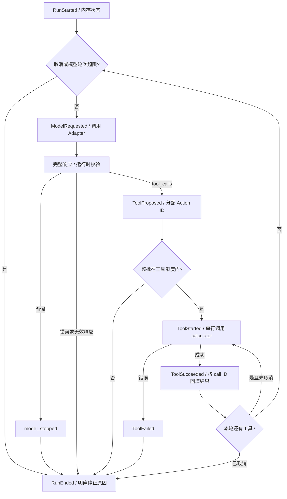

# #4 可观察的最小串行 Agent Loop

对应 [Issue #4](https://github.com/zlpoot/agent-runtime/issues/4)。先阅读 `01-runtime-mental-model.md`，再运行本课实验。学习记录与人工勾选由用户完成。

## 一次 Loop

`transitionRun()` 是纯函数：读取状态和输入，返回新状态、事件草稿及一个待执行命令。`runAgent()` 承载执行层：调用模型或工具，把响应或异常送回状态转换，并给事件分配序号和耗时。工具真正执行的位置是 `packages/core/src/run-agent.ts` 中的 `await options.executeTool(...)`；提案被解析时还没有发生执行。

一次 `generate()` 对应一个 ModelTurn。工具结果回填后，Loop 发起的是另一次模型请求；`while` 的持续运行不表示模型永远留在同一次请求中。一个 ModelTurn 可以等待很久：`ManualGate` 实验会在被释放或取消之前等待。因此，长任务可以由多个模型请求与工具等待组成，也不能由此推断每次请求都很短。

## 本阶段的规则

- 状态仅驻留内存，进程退出就会丢失。JSONL 输出用于观察；崩溃恢复和事件持久化尚未实现。
- 完整响应先经 `parseModelResponse()` 校验，随后才能产生工具命令；接口只接收完整响应。一轮多个调用按数组顺序执行，每次等待前一个调用结束。
- 上下文先追加 `assistant_tool_calls`，再按相同顺序追加 `tool_result`。Runtime 校验结果的 `providerCallId` 与当前 Action 的调用 ID 匹配。
- `modelTurnId`、`actionId`、`attemptId` 由 Runtime 生成；同一 provider call ID 在后续轮次再次出现时会得到新的 Action ID。本阶段每个 Action 只有一次 Attempt，错误立即结束 Run。
- `maxModelTurns` 计数已发出的模型命令，`maxToolCalls` 计数已启动的工具命令，失败也消耗额度。工具额度不足时，整批有效提案仍可观察，但整批都不会启动。
- 取消检查发生在发命令之前及等待返回之后，`AbortSignal` 同时传给 Adapter 和执行器。可控 Fake Model/测试替身会响应取消；尚未提供强制终止不配合的组件或执行超时。
- `final` 对应 `model_stopped`，仅表示模型停止。本阶段还没有验证真实业务目标的完成条件。

## 观察协议

模型请求、响应和工具结果使用 `schemaVersion: 1`。本阶段将 RuntimeEvent 升为 `schemaVersion: 2`：使用 RunStarted、ModelRequested、ModelResponded、ModelFailed、ToolProposed、ToolStarted、ToolSucceeded、ToolFailed、RunEnded，并移除事件中的原始 Action 和错误正文。消费者应按版本解释事件。

每个 Run 的事件序号从 1 递增。`elapsedMs` 表示从 Run 开始计时的经过时间；完成事件的 `durationMs` 表示该次请求/执行的等待时间。`now()` 可在测试中注入；测试比较逻辑事件时排除时间字段，并固定合成 runId。

默认 trace 只含 Runtime 生成的关联 ID、状态、计数、错误码和耗时，省略原始上下文、provider call ID、工具名/参数/结果、模型文本和异常消息。API 返回值 `finalText` 仍是模型内容；导出 trace 时使用 `events` 或 CLI 的 JSONL 输出。

## 学习练习（用户填写）

1. 运行前阅读 normal 场景脚本，预测模型轮次、工具调用数和结束原因；运行后对照 trace。
2. 在流程图上标出提案、决策、真正执行、结果回填四个位置，并在源码中找到对应语句。
3. 将工具额度设为 1，预测第一轮的两个提案会执行几个；运行后解释整批检查的行为。
4. 比较 repeat 场景里的 provider call ID 与 trace 中的 Action ID，解释新提案与重试的区别。
5. 运行取消实验，说明谁发出取消、在哪个等待点生效、还有没有下一轮工具。
6. 用自己的话解释：为什么 `while` 不表示一次无限长模型请求？为什么 final 不能直接代表业务验收完成？
