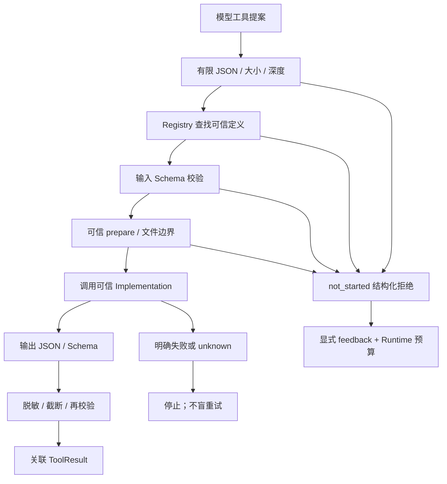

# #6：为什么需要工具网关

`ToolCall` 的 TypeScript 类型只能帮助开发者写程序。运行时来自模型的 JSON 可以缺字段、带错类型或额外字段，仍必须检查。网关的角色是把模型数据与可信工具实现分开。

## 三个概念

| 概念 | 内容 | 由谁提供 |
| --- | --- | --- |
| Tool Definition | 名称、版本、说明、入/出 Schema、副作用、资源、超时、协作取消 | 可信应用代码 |
| Tool Implementation | 执行具体能力的函数，必要时使用 AbortSignal | 可信应用代码 |
| Tool Gateway | 校验、查找、派发、超时、输出处理和错误包装 | Runtime 调用的执行器 |

`registry.definitions()` 返回独立副本，可以作为模型能力说明；模型更改副本或参数不会改写 Registry。此阶段不引入真实 provider 的工具声明映射。

## 错误也是协议

| 错误码 | 含义 | 常见 outcome |
| --- | --- | --- |
| VALIDATION_ERROR / TOOL_NOT_FOUND | 契约不合法或工具未知 | not_started |
| INPUT_LIMIT_EXCEEDED / PATH_NOT_ALLOWED | 大小/深度或文件边界拒绝 | not_started |
| EXECUTION_ERROR | 可信实现失败；原始异常不公开 | pure 工具 failed；在途文件操作可能 unknown |
| INVALID_OUTPUT / OUTPUT_LIMIT_EXCEEDED | 已执行但结果不合法/过大 | pure 工具 failed；有潜在外部效果时 unknown |
| TIMEOUT / CANCELLED | 截止时间或控制入口取消 | 未开始为 not_started，开始后为 unknown |
| BUSY | 早先调用仍在进行，不启动第二个 | not_started |

`ToolResult.error` 包含有限消息、outcome、actionId、attemptId。providerCallId 关联模型提案；Action / Attempt 来自 Runtime，模型不能自报。Runtime 检查三者关联。

not_started 表明本次工具实现没有开始，不表示将来调用已经获批。failed 是实现或结果明确失败，不能据此推断所有外部状态都未改变。unknown 表明网关没有可用的确定结果，超时不能回滚已发生的效果。

默认工具错误停止。实验显式设置 `toolErrorPolicy: "feedback"`，只回填 not_started，Fake 下一轮返回修正提案。修正不是自动重试原动作，而是新提案、新 Action、独立预算。持续提交坏参数仍会耗尽预算。

## 阅读顺序

1. [协议](../../packages/model/src/protocol.ts)：ToolError、ToolOutcome、parseToolResult。
2. [Registry](../../packages/tools/src/registry.ts)：可信定义、不可变副本和 Ajv 编译。
3. [JSON 边界](../../packages/tools/src/json-boundary.ts)：有限遍历、拒绝 getter/cycle/非 JSON、脱敏与截断。
4. [Gateway](../../packages/tools/src/gateway.ts)：输入校验、prepare、派发、deadline race 和 unsettled/BUSY。
5. [内置工具](../../packages/tools/src/builtins.ts)、[文件边界](../../packages/tools/src/workspace.ts)：纯 calculator、合成资料读取、新报告。
6. [状态转换](../../packages/core/src/run-state.ts)：feedback 和 unknown 分支；没有 calculator/read_fixture/write_report 名称分支。
7. [实验](../../labs/tool-gateway/README.md)：先写预测，再看 trace。

## 公开实现对照

实际使用并读取的库为 Ajv **8.20.0**（package.json + pnpm-lock 固定）。其安装包 `dist/ajv.js` 设置 draft-07 词汇和 meta-schema，`dist/compile/index.js` 生成校验函数；本项目只交给它可信 schema，不交给它模型生成的可执行程序。官方 [选项](https://ajv.js.org/options.html) 说明 strict / ownProperties / coerceTypes 等行为；[安全说明](https://ajv.js.org/security.html) 强调 schema 信任以及数据深度/大小风险。这里用有限 JSON 边界和关闭 allErrors 限制验证负担。

Node **22.22.1** 的 [文件 API 文档](https://nodejs.org/download/release/v22.22.1/docs/api/fs.html) 对 open 的 wx 语义有说明：已有路径（包含符号链接）拒绝创建。这个行为不提供整个父目录链的原子隔离保证，也不替代 sandbox。详见 [ADR-003](../adr/003-bounded-tool-gateway.md)。
