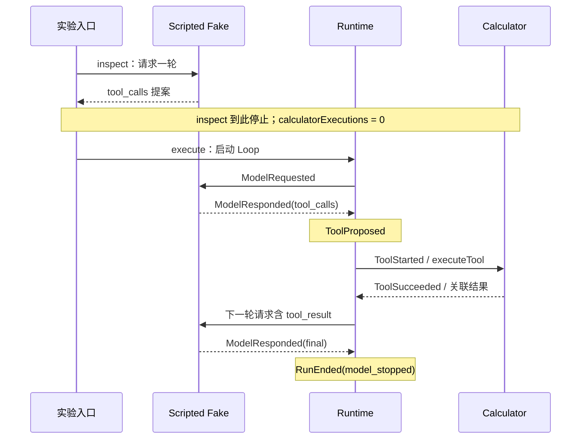

# #5：观察、执行和破坏 Agent Loop

关联 [Issue #5](https://github.com/zlpoot/agent-runtime/issues/5)。使用已有 Fake Model、Runtime 和纯 calculator；所有输入是合成数据。此实验只完成 M0 工程材料，学习验收和进入 M1 仍需用户确认。

## 先预测，再运行

先复制 [空白记录](LEARNING_RECORD.template.md) 为 `LEARNING_RECORD.local.md`（已忽略），自己填写每项预测。不要先看 [答案参考](REFERENCE.md)。

```powershell
Copy-Item labs/01-agent-loop/LEARNING_RECORD.template.md labs/01-agent-loop/LEARNING_RECORD.local.md
```

Node 22.22.1、pnpm 10.33.0；仓库根目录执行：

```sh
pnpm install --frozen-lockfile
pnpm lab agent-loop inspect
pnpm lab agent-loop execute
pnpm lab agent-loop break
pnpm lab agent-loop step
```

每次入口先构建 workspace。`step` 在模型返回前、计算器执行前、下一轮模型返回前分别等待输入：先在自己的记录里预测，Enter 继续；非空输入（例如 `q`）、EOF 或 Ctrl+C 取消。它在现有请求/执行器内部等待，`ModelRequested` / `ToolStarted` 已输出不代表响应/计算已完成。它没有持久化暂停或恢复协议。

`inspect` 没有 Loop，因此不应用 Runtime 额度；额度参数只用于另外三种模式。运行 `pnpm lab agent-loop --help` 查看参数。

## 短课文：提案、命令与结果

四个模式使用同一份固定提案：`calculator` 的 `add(2, 3)`。`inspect` 直接请求 Fake 并停在响应；`execute` 把响应交给 Runtime；`break` 默认持续产生提案，观察预算；`step` 让你在关键边界先预测。模型每一轮都有独立请求，Runtime 保存上下文、选择下一个命令并管理停止原因。

默认输出只显示事件名称与计数。`LabObservation` 中：

| 字段 | 用来观察什么 |
| --- | --- |
| `proposedToolCalls` | 模型已提出多少个有效调用；inspect 从响应计数，其余从 ToolProposed 计数 |
| `toolCommands` | Runtime 已启动多少次执行器命令 |
| `calculatorExecutions` | 实际调用纯 calculator 的次数；在真实调用点累加 |
| `lastModelToolResults` | Fake 收到的最后一个请求包含多少个 tool_result；不是累计回填总数 |
| `status` / `reason` | 本次运行停止状态和原因；final 只说明模型停止 |

`ToolStarted` 是执行器命令开始，执行器可以等待输入或返回错误，因此它不能单独证明 calculator 已执行。工程观察计数也不代表用户已经理解。

## 阅读顺序与关键类型

1. [`packages/model/src/protocol.ts`](../../packages/model/src/protocol.ts)：`ToolCall`（模型提案）、`ToolResult`（带关联 ID 的结果）、`ModelRequest` / `ModelResponse`（轮次边界）、`RuntimeEvent`（脱敏元数据）。
2. [`packages/model/src/scripted-fake-model.ts`](../../packages/model/src/scripted-fake-model.ts)：`ScriptedFakeModel.generate` 和 `expectToolResultCallId`；没有真实模型请求。
3. [`packages/core/src/run-state.ts`](../../packages/core/src/run-state.ts)：`RunState`、`RunInput`、`RunCommand`、`transitionRun`；追踪预算、final 分支和结果回填。
4. [`packages/core/src/run-agent.ts`](../../packages/core/src/run-agent.ts)：`runAgent` 的 while、模型与工具实际调用点；对照状态转换。
5. [`packages/tools/src/calculator.ts`](../../packages/tools/src/calculator.ts)：`executeCalculator`；纯算术，没有 shell。
6. [`src/engine.ts`](src/engine.ts)、[`src/main.ts`](src/main.ts)：`runLab` 包装实验、计数和外部单步输入；核心 Runtime 没有改动。
7. [`tests/agent-loop-lab.test.ts`](../../tests/agent-loop-lab.test.ts)：解释执行、协议、调度三个层次的故障。

## Trace 对照图



先自己比较 [inspect](traces/inspect.jsonl)、[execute](traces/execute.jsonl)、[break](traces/break.jsonl) 和 [step](traces/step.jsonl)。`step` 提交的 trace 是工程自动输入 Enter 的证据，不是用户学习验收。模型 DTO 版本 1，RuntimeEvent 版本 2，TeachingPause / LabObservation 版本 1；按 `kind` 识别。`labSequence` 排列整个实验；Runtime 的 `sequence` 只排列 Runtime 事件，每次运行重新从 1 开始。耗时随运行变化。

## 故障实验

在填写每个预测后运行：

```sh
pnpm lab agent-loop break --fault no-dispatch
pnpm lab agent-loop break --fault missing-result
pnpm lab agent-loop break --fault wrong-call-id
pnpm lab agent-loop break --fault infinite
pnpm lab agent-loop break --max-tool-calls 0
```

故障只注入教学适配器：no-dispatch 替换执行器但不调用 calculator；missing-result 在进入 Fake 前剔除回填消息；wrong-call-id 在 calculator 返回后改变关联 ID；infinite 每轮产生新提案，没有 final 或脚本耗尽的停止条件。完成预测和观察后，查看 [参考解释与预期结果](REFERENCE.md)。无需修改生产 Loop，也不会留下待恢复的故障开关。所有结果仍保留在内存。

## JSONL、检查与验收

构建完成后，用以下命令获得纯 JSONL（`pnpm lab` 的构建日志不会混入）：

```sh
node labs/01-agent-loop/dist/main.js agent-loop execute --jsonl
pnpm typecheck
pnpm test
pnpm build
```

JSONL 只有元数据，不输出原始输入、参数、结果正文或模型文本。预期故障/预算结束的实验进程退出 0，状态看 LabObservation；取消退出 130，参数/工程异常退出 1。验证见 [工程记录](VERIFICATION.md)。

请用户独立完成记录中的四个 Explain 问题和 M0 Gate。实验 PR 合并后 Issue #5 仍须保持打开，直到用户学习验收与进入 M1 的授权有明确记录；Codex 不勾选这两项，也不自动启动 #6。
